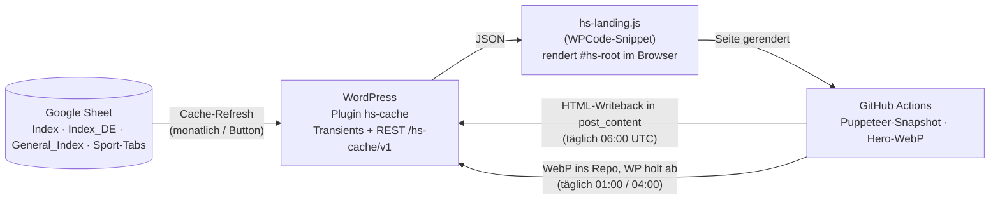

# HEIM:SPIEL Landingpage-System

Dieses Repository enthält den gesamten eigenen Code hinter den Sportdaten-Landingpages auf
[heimspiel.de](https://heimspiel.de) (z. B. `/football/`, `/de/wintersport/biathlon/`,
`/us-sports-package/`). Die Seiten werden nicht von Hand gepflegt: Ein Google Sheet ist die
einzige Redaktionsquelle, WordPress cached und aggregiert die Daten, ein JavaScript rendert
die Seite im Browser, und ein nächtlicher Prerender-Workflow schreibt das gerenderte HTML
zurück in WordPress, damit Suchmaschinen und KI-Crawler vollständigen Inhalt sehen.

## Dokumentation

| Dokument | Für wen | Inhalt |
|---|---|---|
| [docs/01-architektur.md](docs/01-architektur.md) | Alle | Systemkontext, Komponenten, Datenmodell (Sheet-Schemas), Seitentypen und Templates |
| [docs/02-ablauf.md](docs/02-ablauf.md) | Alle | **Flow-Charts:** Lebenszyklus einer Seite vom Sheet bis zum Snapshot, Request-Ablauf, Hero-Bilder, Übersetzungen, Zeitplan aller Automatismen |
| [docs/03-dateien.md](docs/03-dateien.md) | Entwickler | Jede Datei im Repository: Zweck, Ablageort auf dem Server, Abhängigkeiten, Funktionen |
| [docs/04-betrieb.md](docs/04-betrieb.md) | IT / Betrieb | Deployment, Secrets, Cron-Übersicht, Sicherheitsbetrachtung, Runbooks, bekannte Fallstricke |

Für den Arbeitsalltag mit der REST-API siehe außerdem [CLAUDE.md](CLAUDE.md) bzw.
[AGENTS.md](AGENTS.md) (Wrapper `scripts/wp.mjs`).

## In 60 Sekunden



1. Die Redaktion pflegt Zeilen im Google Sheet (eine Zeile pro Seite, dazu ein Tab pro Sportart mit allen Wettbewerben).
2. Der **HS Provisioner** (WP-Plugin) legt aus diesen Zeilen leere Seiten an, die nur einen Container `<div id="hs-root" data-…>` enthalten.
3. Das Plugin **HEIMSPIEL Data Cache** holt das Sheet, cached es 31 Tage als Transients und stellt es unter `/wp-json/hs-cache/v1/…` bereit — inklusive vorberechneter Aggregationen (Coverage, Bundle-Totals, Event-Coverage).
4. **hs-landing.js** baut im Browser aus diesen JSON-Daten die komplette Seite in den Container.
5. Ein **GitHub-Actions-Workflow** rendert jede Seite nachts mit Puppeteer und schreibt das fertige HTML in den Container zurück (Snapshot). Ab dann liefert WordPress vollständigen Inhalt aus, das JavaScript rendert darüber nur noch live nach.
6. Das MU-Plugin **hs-seo-meta.php** erzeugt serverseitig `<title>`, Meta-Description, Open Graph und JSON-LD — aus Sheet-Daten und aus dem gespeicherten Snapshot.

## Repository-Layout

```
.
├── heimspiel-data-cache.php      Plugin-Hauptdatei  → wp-content/plugins/hs-cache/
├── cache.php, rest-api.php, …    Plugin-Includes    → wp-content/plugins/hs-cache/includes/
├── hs-landing-provisioner-v4.15.php  Eigenes Plugin → wp-content/plugins/hs-landing-provisioner-v4.15/
├── hs-seo-meta.php, hs-perf.php, hs-rest-gzip.php, hs-translations.php, hs-landing.css
│                                 MU-Plugins         → wp-content/mu-plugins/
├── hs-landing-v101.24.js         Frontend-Quelle    → als hs-landing.min.js in WPCode-Snippet 1432
├── scripts/                      Node-Skripte für GitHub Actions und lokale REST-Arbeit
├── .github/workflows/            Prerender-Workflows (Snapshot, Hero-Bilder)
├── dist/hero-images/             Von GitHub Actions erzeugte WebP-Hero-Bilder
└── test-*.php                    Lokale Logiktests ohne WordPress
```

Die genaue Zuordnung jeder Datei steht in [docs/03-dateien.md](docs/03-dateien.md).

## Lokale Tests

```bash
php test-event-coverage.php && php test-bundle-coverage.php
```

Beide Tests laden `cache.php` mit WordPress-Stubs und brauchen weder Datenbank noch Netz.
