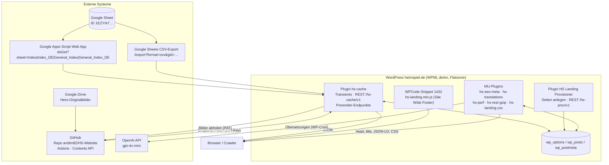
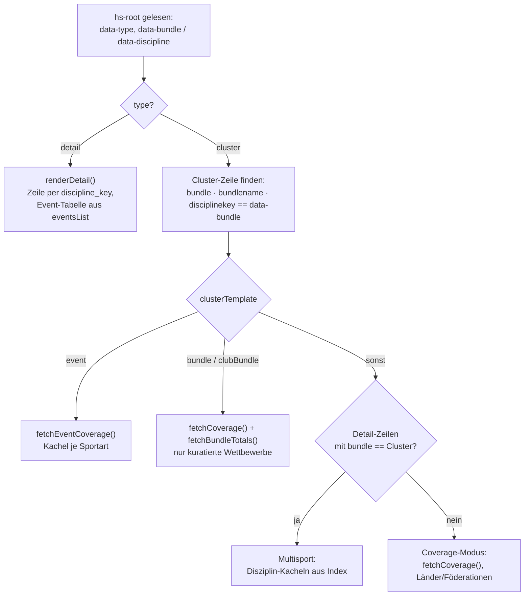

# 01 · Architektur

Stand: 2026-09-21, Code-Stand Commit `5a07415` (Branch `wp-rest-zugriff`).

## 1. Systemkontext

| System | Rolle | Zugriff |
|---|---|---|
| Google Sheet | Einzige Redaktionsquelle für Seiten, Texte, Wettbewerbe | WordPress liest; niemand schreibt programmatisch |
| Apps Script Web App | Liefert die vier Steuer-Tabs als JSON (`?sheet=…`) | Öffentliche `/exec`-URL, in `heimspiel-data-cache.php` fest hinterlegt |
| CSV-Export | Liefert die Sport-Tabs (ein Tab je Sportart, per `gid`) | Öffentlicher Export-Link derselben Tabelle |
| Google Drive | Ablage der Hero-Originalbilder (Freigabelink in Spalte `heroBgUrl`) | Anonymer Download durch GitHub Actions |
| GitHub | Quellcode, zwei Workflows, Ablage der WebP-Bilder in `dist/hero-images` | Actions schreiben ins Repo; WordPress liest per Fine-grained PAT |
| OpenAI | Übersetzung von Wettbewerbs- und Statistik-Namen (EN) | Nur serverseitig aus WP-Cron, Key in `wp-config.php` |

## 2. Komponenten in WordPress

| Komponente | Art | Ablageort | Dateien aus diesem Repo |
|---|---|---|---|
| **HEIMSPIEL Data Cache** v1.4 | Plugin | `wp-content/plugins/hs-cache/` | `heimspiel-data-cache.php`; `includes/`: `cache.php`, `rest-api.php`, `prerender-api.php`, `prerender-sync.php`, `prerender-snapshot.php`, `hs-wpml-auto-translate-exclusions.php`, `cron.php`, `admin.php` |
| **HS Landing Provisioner** v4.15 | Plugin | `wp-content/plugins/hs-landing-provisioner-v4.15/` | `hs-landing-provisioner-v4.15.php` |
| **HEIM:SPIEL SEO Meta** v1.7.0 | MU-Plugin | `wp-content/mu-plugins/` | `hs-seo-meta.php`, `hs-landing.css` |
| **HEIM:SPIEL Translations** v4 | MU-Plugin | `wp-content/mu-plugins/` | `hs-translations.php` |
| **HEIM:SPIEL Performance** | MU-Plugin | `wp-content/mu-plugins/` | `hs-perf.php` |
| **HEIM:SPIEL REST gzip** | MU-Plugin | `wp-content/mu-plugins/` | `hs-rest-gzip.php` |
| **hs-landing.js** | WPCode-Snippet (ID 1432, Typ JavaScript, „Site Wide Footer") | WordPress-Datenbank, nicht Dateisystem | Quelle `hs-landing-v101.24.js`, deployt wird `hs-landing.min.js` |

Wichtige Fremdkomponenten, die das Verhalten beeinflussen: **WPML** (Sprachen `de` mit Präfix `/de/`, `en` ohne Präfix), **Flatsome** (Theme), **WPCode Lite** (trägt das JavaScript), **WP Super Cache** (Seitencache — nach Deployments leeren), **Autoptimize** (CSS-Bündelung), **OMGF** (lokale Google Fonts), **Meta Tag Manager** (dessen fehlerhafte og-Tags werden von `hs-seo-meta.php` auf Landingpages unterdrückt).

> **MU-Plugins laden automatisch jede `.php` im Ordner.** Deshalb dürfen dort keine Sicherungskopien wie `hs-translations~.php` liegen — sie würden sofort ausgeführt und mit „Cannot redeclare function" die gesamte Site lahmlegen. Sicherungskopien nur im Plugin-Ordner `includes/` (dort werden nur explizit gelistete Dateien geladen).

## 3. Datenmodell

Alle Daten stammen aus **einer** Google-Tabelle. Sie hat zwei Arten von Tabs.

### 3.1 Steuer-Tabs (über Apps Script als JSON)

| Tab | Inhalt | REST-Route | Transient |
|---|---|---|---|
| `Index` | Eine Zeile je Seite (EN): 9 Cluster-, 14 Detail-Zeilen | `/hs-cache/v1/index` | `hs_index_data` |
| `Index_DE` | Dieselben Zeilen mit deutschen Texten | `/hs-cache/v1/indexDe` | `hs_index_de_data` |
| `General_Index` | Genau eine Zeile: seitenübergreifende Texte (EN) | `/hs-cache/v1/generalIndex` | `hs_general_index_data` |
| `General_Index_DE` | Dito deutsch | `/hs-cache/v1/generalIndexDe` | `hs_general_index_de_data` |
| `Translations` (gid 1129563872) | Glossar: Spalte A Quellbegriff, weitere Spalten je Sprachcode | — (intern) | `hs_glossary_data` |

Der Apps Script liefert `{ "Index": [ {…}, … ] }`; Zeilen ohne Inhalt (die Redaktion hält unter den Daten leere Formelzeilen vor) werden dort bereits verworfen.

#### Spalten des Index (39)

Gruppiert nach Zweck. Schlüsselschreibweise ist im Sheet gemischt (`discipline_key`, `heroBgUrl`); alle Konsumenten normalisieren auf Kleinschreibung, `hs-seo-meta.php` entfernt zusätzlich Unterstriche.

| Gruppe | Spalten | Verwendung |
|---|---|---|
| **Identität** | `type` (`cluster` / `detail`), `discipline_key`, `bundleName`, `name`, `displayName`, `bundle`, `detail_url` | `discipline_key` ist der kanonische Schlüssel (Slug, `data-bundle` bzw. `data-discipline` im Seiten-Container, Cache-Keys). `detail_url` ist der Pfad der Seite. `bundle` verknüpft Detail- mit Cluster-Zeilen (Detail-Zeile trägt den `bundle`-Wert ihrer Eltern-Zeile). |
| **Datenquelle** | `gid` | CSV-Tab der Sportart. Nur Cluster-Zeilen mit eigenem Tab haben eine gid; Bundle-, ClubBundle- und Event-Cluster haben keine. |
| **Template** | `clusterTemplate`, `detailTemplate`, `topCompetitions`, `nameFilter` | Siehe Abschnitt 4. |
| **Hero / Kopf** | `eyebrow`, `sportEyebrow`, `heroHeadline`, `description`, `heroBgUrl`, `heroBgUrlCached`, `subText` | `heroBgUrl` = Drive-Link (Original), `heroBgUrlCached` = lokale WebP-URL nach dem Bild-Workflow; Frontend und SEO bevorzugen `Cached`. |
| **Kennzahlen (Detail)** | `totalEvents`, `livetickCount`, `liveCompetitions`, `eventsList`, `statsList`, `livetickList`, `eventsCol`, `statsCol`, `livetickCol`, `eventsTitle` | Detail-Seiten (Wintersport-Disziplinen) bekommen ihre Event-Tabelle als zeilengetrennte Zellen (`TEXTJOIN(CHAR(10))`). |
| **Texte** | `preEvent`, `live`, `postEvent`, `imageLibrary`, `relatedServices`, `labelSports`, `labelEvents`, `labelLiveticker`, `labelTopCompetitions` | Textbausteine und Beschriftungen, überschreiben die Defaults aus `General_Index`. |
| **SEO** | `seoDescription` | Meta-Description; fehlt sie, kürzt `hs-seo-meta.php` aus `description`. |

#### Spalten des General_Index (122)

Eine einzige Zeile mit allen seitenübergreifenden Texten: Kontaktformular (`Contact Field1–5`, `ContactTitle`, …), CTA (`ctaText`, `ctaUrl`), neun Trust-FAQs (`FAQ1headline/text` … `FAQ9…`), vier SEO-FAQ-Templates mit Platzhaltern (`seoFaqTpl1–4Headline/Text`), Integration-Sektion (`integration*`), Mid-CTA, Partner-Logos (`PartnersSection1–4Logo1–8`), Trust-Kennzahlen (`TrustSectionValue1–7`), alle UI-Labels (`label*`), Übersetzungshilfen (`genderTranslations`, `logoAltMap`).

Die SEO-FAQ-Templates nutzen Platzhalter (`{eyebrow}`, `{totalCompetitions}`, `{topLeagueNamesList}`, …) und Bedingungsblöcke (`{{#isBundleTemplate}}…{{/isBundleTemplate}}`). Ein Template wird nur gerendert, wenn **alle** von ihm benötigten Variablen einen Wert haben (`SEO_FAQ_TEMPLATES` in `hs-landing.js`).

### 3.2 Sport-Tabs (über CSV-Export)

Ein Tab je Sportart, eine Zeile je **Wettbewerb und Saison**. Aktuell fünf Tabs: Wintersport (5.827 Zeilen), Fußball (11.323), Basketball (2.317), Eishockey (968), American Football (149).

Vom Backend ausgewertete Spalten:

| Spalte | Bedeutung |
|---|---|
| `competition_id` | Eindeutig **über alle Tabs hinweg** (3.299 IDs, keine Kollision — Voraussetzung für Bundle- und Event-Template) |
| `name` (alt. `competition_name`) | Wettbewerbsname, Grundlage von Anzeige, Namensfilter und Übersetzung |
| `country`, `federation` | Gruppierung in Länder- und Föderationskacheln |
| `season_end` | Saison-Clusterung (Lücke > 200 Tage = neue Saison); Wettbewerbe ohne Saison in den letzten 4 Jahren und ohne angekündigte Saison gelten als eingestellt |
| `number_matches`, `live_status_*`, `results_exits`, `ranking_*` | Kennzahlen der letzten **abgeschlossenen** Saison |
| `stats_list` bzw. `result_list` | Verfügbare Statistiken (Pills). Der Wintersport-Tab nennt die Spalte `result_list`; beide werden gleich behandelt |
| `sport` | Nur Wintersport: Disziplin (Ski Alpin, Biathlon, …) — Gruppierungsebene für Multisport- und Event-Template |
| `gender`, `age`, `competition_order` | Suffixe („(F)"), Ausschluss von Jugendwettbewerben aus Top-Rankings, Sortierung |

### 3.3 WordPress-Datenhaltung

| Ort | Schlüssel | Inhalt | Lebensdauer |
|---|---|---|---|
| Transient | `hs_index_data`, `hs_index_de_data`, `hs_general_index_data`, `hs_general_index_de_data` | Steuer-Tabs | 31 Tage (`HS_CACHE_TTL`) |
| Transient | `hs_csv_{gid}` | Sport-Tab als Array | 31 Tage |
| Transient | `hs_coverage_{slug}`, `hs_bundle_totals_{slug}`, `hs_event_coverage_{slug}` | Vorberechnete Aggregationen je Cluster | 31 Tage |
| Transient | `hs_glossary_data` | Glossar-Tab | 31 Tage |
| Transient | `hs_seo_meta2_{post_id}_{lang}` (`HS_Seo_Meta`) | Berechnete Meta-Daten je Seite/Sprache | 6 h, gelöscht bei `save_post` |
| Transient | `hs_landing_css_{filemtime}` (`HS_Seo_Meta::landing_css()`) | Inhalt von `hs-landing.css`; neuer Schlüssel bei jeder Dateiänderung, daher kein manuelles Leeren nötig | 1 Tag |
| Transient | `hs_trans_lock_{lang}_{md5}` | Sperre gegen parallele OpenAI-Aufrufe | 5–10 min |
| Option (autoload=no) | `hs_trans_{lang}_{md5(cacheKey)}` | Übersetzungen, dauerhaft (`comp_all`, `stats_all`, `events_{key}`) | unbegrenzt |
| Option | `hs_cache_refresh_report`, `hs_cache_last_run`, `hs_cache_*_count`, `hs_prerender_sync_last_report` | Betriebsberichte für die Admin-Seite | überschrieben je Lauf |
| Post-Meta | `_hs_no_auto_translate` | Provisioner-Marker: schließt Seite von WPML-Autoübersetzung aus | dauerhaft |
| Post-Meta | `_hs_last_snapshot_at`, `_hs_last_snapshot_url` | Letzter Snapshot-Writeback | überschrieben |
| Attachment-Meta | `_hs_prerender_filename`, `_hs_prerender_discipline_key` | Idempotenz-Marker des Bild-Imports | dauerhaft |
| `post_content` | `
…
` | Provisioner-Shell; nach dem Snapshot enthält der Container das gerenderte HTML | wird täglich neu geschrieben |

## 4. Seitentypen und Templates

Jede Seite ist entweder **Cluster** (Sportart / Paket) oder **Detail** (Disziplin unterhalb eines Clusters). Das Template einer Cluster-Seite steht in der Index-Spalte `clusterTemplate`:

| `clusterTemplate` | Beispiel | Auswahl der Wettbewerbe | Darstellung | Backend-Funktion |
|---|---|---|---|---|
| `general-purpose` | Fußball, Basketball, Eishockey, American Football | Ganzer Sport-Tab (eigene `gid`), `topCompetitions` steuert nur die Rangfolge | Top-Wettbewerbe + aufklappbare Länder-/Föderationskacheln | `hs_build_coverage_for_sport()` Fall A |
| `multisport` | Wintersport | Detail-Zeilen des Index (Spalte `bundle` = Cluster) | Eine Kachel je Disziplin mit Link auf Detailseite | Frontend aus `disciplines`, kein Coverage-Abruf |
| `bundle` | US Sports | `topCompetitions`-IDs, **über alle Sport-Tabs gesucht** (seit 2026-09-04); `bundle`/`bundleName` sind freie Paketnamen | Nur die kuratierten Wettbewerbe, ohne Länderblock | Fall B mit `hs_collect_sport_tabs()` |
| `clubBundle` | 1. FC Köln | `topCompetitions`-IDs innerhalb der in `bundle` gelisteten Tabs | Wie `bundle` | Fall B mit Mitgliederliste |
| `event` | Olympische Spiele Winter/Sommer | Namensfilter `nameFilter` über alle Sport-Tabs | Eine Kachel je Sportart (Spalte `sport` oder Tab-Name), Wettbewerbe klappen inline auf | `hs_build_event_coverage()` |

Detail-Seiten nutzen `detailTemplate` (aktuell nur `multisport` für die Wintersport-Disziplinen); ihre Daten kommen vollständig aus der eigenen Index-Zeile (`eventsList`/`statsList`/`livetickList`).

### Template-Weiche im Frontend

## 5. REST-Schnittstellen

### Öffentlich, lesend — `hs-cache/v1` (Plugin hs-cache, `rest-api.php`)

Alle Antworten: `Cache-Control: public, max-age=3600`, `Access-Control-Allow-Origin: *`, gzip durch `hs-rest-gzip.php`. Fehlt der Transient, wird er beim ersten Aufruf gebaut (lazy) — der reguläre Weg ist aber der Cache-Refresh.

| Route | Liefert | Quelle |
|---|---|---|
| `GET /index`, `/indexDe` | `{ index: [...] }` / `{ indexDe: [...] }` | Steuer-Tab |
| `GET /generalIndex`, `/generalIndexDe` | `{ generalIndex: [ {…} ] }` | Steuer-Tab |
| `GET /csv/{gid}` | Zeilen des Sport-Tabs | CSV-Export (**beliebige gid** dieser Tabelle, siehe Betrieb → Sicherheit) |
| `GET /coverage/{slug}` | `totalCompetitions, totalCountries, totalMatches, countries[], international[], topCompetitions[]` | `hs_build_coverage_for_sport()` |
| `GET /bundle-totals/{slug}` | `totalEvents, livetickCount, liveCompetitions, perCompetition, debug` | `hs_build_bundle_totals()` |
| `GET /event-coverage/{slug}` | `nameFilter, totalSports, totalEvents, totalLive, sports[]` | `hs_build_event_coverage()` |
| `GET /coverage-debug/{slug}?id=` | Diagnose der Top-Competition-Auswahl | ungecacht |
| `GET/POST /translations/{lang}/{cacheKey}` | `{ translations: {…}, pending }` | `hs-translations.php` (MU-Plugin, gleicher Namespace) |

### Schreibend

| Route | Auth | Zweck | Datei |
|---|---|---|---|
| `POST hs-prerender/v1/snapshot` | Header `X-HS-Snapshot-Key` = `HS_SNAPSHOT_API_KEY` (`hash_equals`) | HTML-Writeback in `#hs-root` einer Seite | `prerender-snapshot.php` |
| `POST hs-prov/v1/link-translation`, `bulk-publish`, `rename-slug`; `GET find-parent` | eingeloggt, `manage_options` (Nonce) | Provisioner-Hilfsfunktionen | `hs-landing-provisioner-v4.15.php` |
| `POST wp/v2/pages` (Core) | Nonce / Application Password | Seiten anlegen (Provisioner) und pflegen (`scripts/wp.mjs`) | WordPress-Core |
| `POST hs-cache/v1/prerender/media`, `/prerender/page` | Application Password + `upload_files` bzw. `edit_pages`+`unfiltered_html` | **Legacy** (Push-Variante, durch Hosting-Firewall für GitHub-IPs blockiert), nicht mehr im Workflow | `prerender-api.php` |

## 6. Konventionen

- **Slugs:** `slugify()` (JS) und `hs_slugify()` (PHP) sind zeichengenau identisch (ä→ae, ö→oe, ü→ue, ß→ss, dann `[^a-z0-9]+`→`-`). Alle Cache-Keys, `data-bundle` und Coverage-Routen basieren darauf.
- **Schlüssel-Normalisierung:** Frontend lowercased Sheet-Keys (`f(obj, key)` sucht case-insensitiv); `hs-seo-meta.php` entfernt zusätzlich `_`. Backend nutzt `array_change_key_case(…, CASE_LOWER)` und spricht `discipline_key` **mit** Unterstrich an.
- **`discipline_key` ist der kanonische Bezeichner** einer Seite in beiden Sprachen. `bundleName` und `bundle` sind seit dem Bundle-Umbau reine Anzeigenamen bzw. Verknüpfung Detail→Cluster.
- **Sprachen:** EN ist WPML-Standardsprache ohne Präfix, DE liegt unter `/de/`. Das Frontend erkennt die Sprache am `<html lang>` und wählt `index`/`indexDe`. Der englische Index ist zugleich die Strukturquelle: `gid`, `clusterTemplate` und `topCompetitions` werden nur aus `Index` gelesen; `Index_DE` liefert Texte.
- **Zwei Renderer:** Panels (Wettbewerbslisten) werden einmal für den Snapshot vorgerendert (`hsPrerenderPanels()`, Statistik-Zellen bewusst leer) und beim Aufklappen live neu gebaut (`hsRenderCompetitionPanel()`, mit Pills). Änderungen an Zeilen-Markup müssen an **beiden** Stellen erfolgen.
- **CSS:** Einzige Quelle ist `hs-landing.css` (MU-Plugin liefert es als `<style id="hs-landing-styles">`). Die vier CSS-Blöcke in `hs-landing.js` sind nur noch Fallback und greifen nicht, solange die Datei vorhanden ist.
