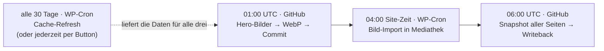
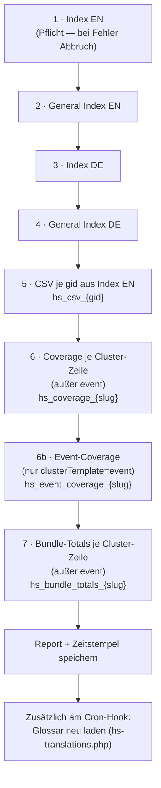
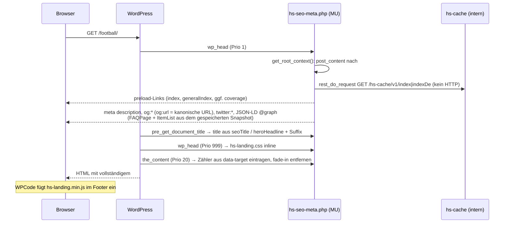
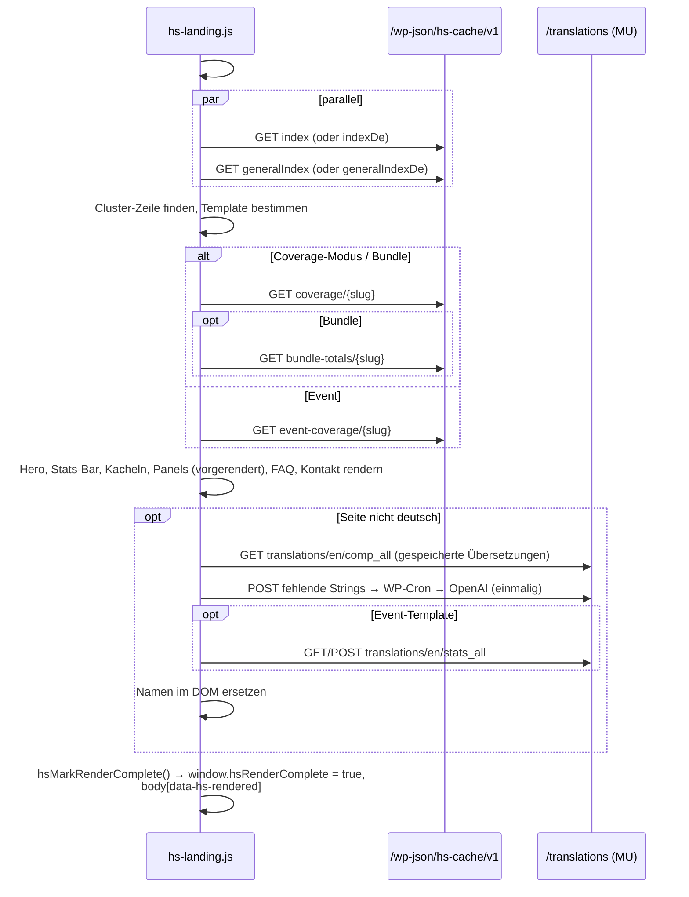
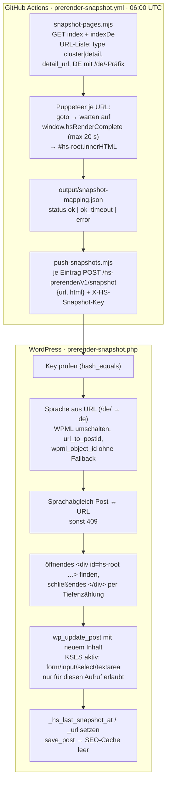
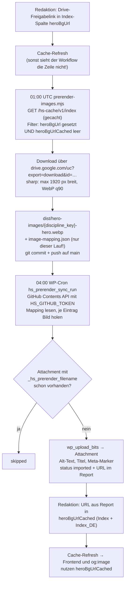
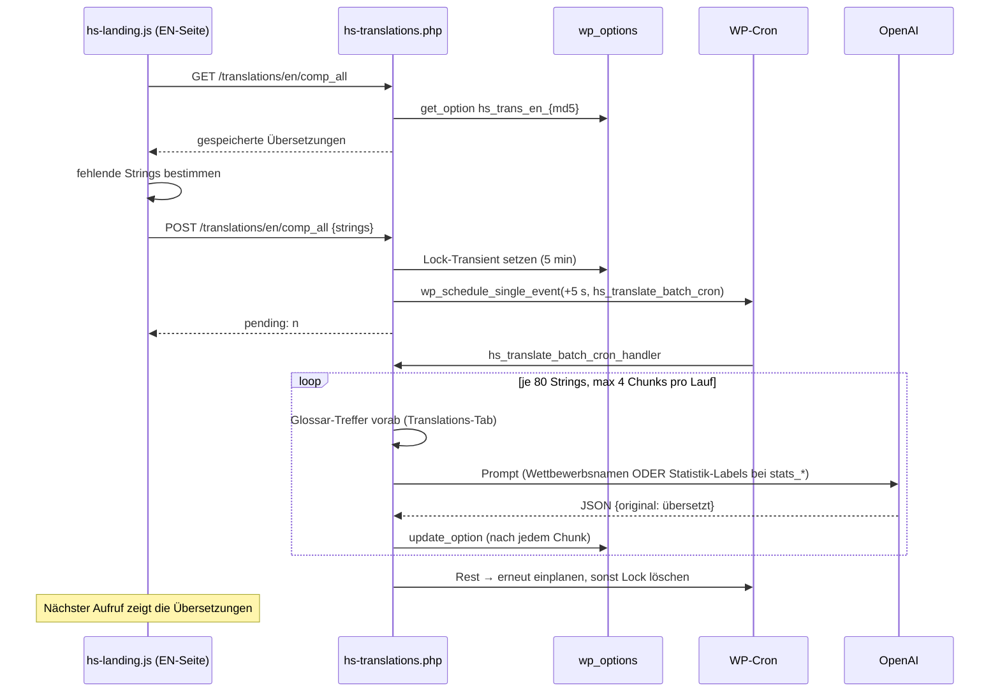

# 02 · Abläufe: Was passiert wann

Dieses Dokument beantwortet die Frage „was passiert wie und wann" — vom Anlegen einer Seite über
den Provisioner, das Caching, das Rendering, die Snapshots bis zu den Hero-Bildern. Die
Diagramme sind Mermaid und werden auf GitHub direkt gerendert.

## 1. Zeitplan aller Automatismen

| Wann | Was | Wo | Auslöser | Manuell |
|---|---|---|---|---|
| **alle 30 Tage** | Cache-Refresh: Steuer-Tabs, alle Sport-CSVs, Coverage, Bundle-Totals, Event-Coverage, Glossar | WP-Cron `hs_refresh_all_cache_event` (Intervall `hs_monthly`) | `cron.php` | Button „Cache jetzt aktualisieren" (Einstellungen → HEIM:SPIEL Cache) |
| **täglich 01:00 UTC** | Hero-Bilder: Drive → WebP → Commit nach `dist/hero-images/` | GitHub Actions `prerender-images.yml` | `schedule` | „Run workflow" auf GitHub |
| **täglich 04:00** (Site-Zeit) | Bild-Import: `image-mapping.json` von GitHub holen, neue WebPs in die Mediathek | WP-Cron `hs_prerender_sync_cron` | `prerender-sync.php` | Button „Bilder jetzt synchronisieren" |
| **täglich 06:00 UTC** | Snapshot: alle Cluster-/Detail-Seiten (EN+DE) mit Puppeteer rendern und HTML zurückschreiben | GitHub Actions `prerender-snapshot.yml` | `schedule` | „Run workflow" auf GitHub |
| **bei Bedarf, +5 s** | OpenAI-Übersetzung fehlender Begriffe | WP-Cron Einzelereignis `hs_translate_batch_cron` | Erster Besucher einer EN-Seite mit unbekannten Namen | Reset-Buttons auf der Cache-Seite |
| **bei jedem Speichern** | SEO-Meta-Cache der Seite leeren | Hook `save_post` | Snapshot-Writeback, Redaktion | — |
| **alle 6 h** | SEO-Meta je Seite/Sprache neu berechnen | Transient-Ablauf in `HS_Seo_Meta` | Erster Aufruf nach Ablauf | — |

> **WP-Cron läuft nicht von selbst.** WordPress prüft fällige Ereignisse nur, wenn jemand die
> Site aufruft (oder `wp-cron.php` extern angestoßen wird). Auf einer wenig besuchten Site kann
> der 04:00-Import deshalb erst beim nächsten Seitenaufruf laufen. Die GitHub-Workflows sind
> davon unabhängig und laufen pünktlich.

### Zeitliche Kette an einem Tag

Reihenfolge ist Absicht: Bilder werden **vor** dem Import erzeugt, der Import läuft **vor** dem
Snapshot — so enthält der Snapshot bereits die lokalen Bild-URLs, sofern die Redaktion
`heroBgUrlCached` gepflegt und den Cache aktualisiert hat (siehe Abschnitt 6).

## 2. Lebenszyklus einer neuen Seite (Ende zu Ende)

```mermaid
flowchart TD
    subgraph R["① Redaktion — Google Sheet"]
        R1["Zeile in Index + Index_DE anlegen<br/>type, discipline_key, detail_url, clusterTemplate,<br/>Texte, heroBgUrl (Drive-Link)"]
        R2["Bei neuer Sportart: Sport-Tab anlegen,<br/>gid in die Cluster-Zeile eintragen"]
    end

    subgraph C["② WordPress — Cache (Plugin hs-cache)"]
        C1["Cache-Refresh auslösen<br/>(Button oder Monats-Cron)"]
        C2["Steuer-Tabs + CSVs holen,<br/>Coverage / Totals / Event vorberechnen,<br/>Transients 31 Tage"]
        C3["/wp-json/hs-cache/v1/* liefert<br/>die neue Zeile"]
    end

    subgraph P["③ WordPress — HS Provisioner"]
        P1["Admin: HS Provisioner öffnen,<br/>Cluster aus Dropdown (Cache-Index) wählen"]
        P2["Schritt 1: Cluster-Seite anlegen<br/>POST wp/v2/pages mit Shell<br/>&lt;div id=hs-root data-type=cluster data-bundle=KEY&gt;"]
        P3["Schritt 2: Detail-Seiten anlegen<br/>(nur Multisport) mit Parent = Cluster"]
        P4["EN + DE als WPML-Übersetzungspaar verknüpfen,<br/>_hs_no_auto_translate = true,<br/>Translation Priority = nicht benötigt"]
        P5["Seite bleibt Entwurf,<br/>Veröffentlichen ist Redaktionsentscheidung"]
    end

    subgraph F["④ Browser — hs-landing.js"]
        F1["Seitenaufruf: leerer Container + Loader"]
        F2["index/indexDe + generalIndex laden,<br/>Zeile über data-bundle finden"]
        F3["Template-Weiche → Coverage /<br/>Bundle-Totals / Event-Coverage laden"]
        F4["Komplette Seite in #hs-root rendern,<br/>window.hsRenderComplete = true"]
    end

    subgraph G["⑤ GitHub Actions — nächtlich"]
        G1["01:00 prerender-images.yml:<br/>Drive-Bild → WebP → dist/hero-images/ → Commit"]
        G2["06:00 prerender-snapshot.yml:<br/>Puppeteer rendert Seite,<br/>wartet auf hsRenderComplete"]
        G3["POST hs-prerender/v1/snapshot<br/>(X-HS-Snapshot-Key)"]
    end

    subgraph W["⑥ WordPress — Writeback und SEO"]
        W1["04:00 WP-Cron: WebP aus GitHub<br/>in Mediathek importieren"]
        W2["Redaktion: Mediathek-URL in<br/>heroBgUrlCached eintragen → Cache-Refresh"]
        W3["Snapshot ersetzt Inhalt von #hs-root<br/>(nur dieser Container, KSES aktiv)"]
        W4["save_post → SEO-Meta-Cache leer"]
        W5["Ab jetzt: HTML vollständig im Quelltext,<br/>title / description / OG / JSON-LD aus Sheet + Snapshot"]
    end

    R1 --> R2 --> C1 --> C2 --> C3 --> P1 --> P2 --> P3 --> P4 --> P5
    P5 --> F1 --> F2 --> F3 --> F4
    F4 --> G2 --> G3 --> W3 --> W4 --> W5
    C3 --> G1 --> W1 --> W2 --> C1
    W5 -. "nächste Nacht erneut" .-> G2
```

Zeitlich bedeutet das für eine neue Seite:

| Schritt | Dauer / Zeitpunkt |
|---|---|
| Sheet-Zeile → im Cache sichtbar | sofort nach manuellem Refresh (≈ 60 s Laufzeit), sonst bis zu 30 Tage |
| Provisioner → Seite existiert (Entwurf) | Sekunden |
| Erster Aufruf → Seite gerendert | 1–3 s im Browser (JSON-Abrufe + Rendering) |
| → Inhalt im Quelltext / für Crawler | nach dem nächsten Snapshot-Lauf (06:00 UTC), nur für **veröffentlichte** Seiten mit `detail_url` im Index |
| → Hero-Bild lokal statt Google Drive | Workflow 01:00 → Import 04:00 → Redaktion trägt URL ein → Refresh |

## 3. Cache-Refresh im Detail

`hs_refresh_all_cache_v2()` in `cache.php`. Jeder Abruf wird bis zu dreimal mit Backoff (2 s, 4 s) wiederholt; jede Quelle bekommt einen eigenen Status im Report (`hs_cache_refresh_report`), den die Admin-Seite anzeigt.

Schlägt eine Quelle fehl, bleibt ihr **alter** Transient stehen (kein Löschen vor dem Schreiben). Die Site zeigt dann veraltete, aber vollständige Daten; die Admin-Seite markiert die Quelle rot.

## 4. Ein Seitenaufruf

### 4.1 Serverseitig (PHP, vor dem JavaScript)

Ohne Snapshot (neue oder unveröffentlichte Seite) ist `#hs-root` leer; die SEO-Daten werden dann nur aus dem Sheet gebildet (kein FAQPage, keine ItemList).

### 4.2 Clientseitig (hs-landing.js)

Beim Aufklappen einer Kachel baut `hsRenderCompetitionPanel()` die Liste **neu** (mit Statistik-Pills); die im Snapshot vorgerenderte Liste dient nur Crawlern und dem ersten Eindruck.

## 5. Snapshot-Workflow im Detail

Eigenschaften, die man kennen muss:

- **Nur `#hs-root` wird ersetzt.** Alles davor und danach im `post_content` (Gutenberg-Blöcke, weitere Inhalte) bleibt unverändert. Der Schließ-Tag wird durch Zählen der `div`-Tiefe gefunden — das funktioniert beliebig oft, weil der Browser ausbalanciertes Markup liefert.
- **`<script>`-Tags überleben nicht.** Der Writeback läuft ohne angemeldeten Benutzer, WordPress filtert per KSES. Deshalb trägt die Seite kein Script im Content; das JavaScript kommt aus WPCode.
- **Sprachsicherheit.** Seiten mit identischem Slug in DE und EN (biathlon, skeleton, snowboard) werden über WPML aufgelöst; passt die Sprache nicht, bricht der Writeback mit 409 ab statt die falsche Version zu überschreiben.
- **Was nicht gesnapshottet wird:** Seiten ohne `detail_url` im Index, Zeilen mit anderem `type`, sowie alles, was Puppeteer nicht laden kann. Entwürfe sind für Puppeteer nicht erreichbar (kein Login) und liefern eine 404-Seite ohne `#hs-root` → `error`.
- **Ergebnis prüfen:** Artefakt `snapshot-reports` am Workflow-Lauf (`snapshot-mapping.json`, `push-report.json`); je Seite Post-Meta `_hs_last_snapshot_at`.

## 6. Hero-Bilder im Detail

Ziel: Das Hero-Bild einer Seite liegt als optimiertes WebP in der WordPress-Mediathek statt als Google-Drive-Thumbnail — schneller, unabhängig von Drive, und `og:image`-tauglich.

Drei Punkte, an denen dieser Ablauf in der Praxis hängen blieb:

1. **Der Workflow liest den WordPress-Cache, nicht das Sheet.** Neue `heroBgUrl`-Werte werden erst nach einem Cache-Refresh gefunden. „0 Zeilen gefunden" ist deshalb meist kein Fehler, sondern ein veralteter Cache.
2. **`image-mapping.json` ist ein Delta, kein Inventar.** Sie enthält nur die Bilder des letzten Laufs; findet der Workflow nichts, schreibt er `[]`. Der Import in WordPress ist trotzdem idempotent (Meta-Marker), und bereits importierte Bilder sind auf der Admin-Seite unter „Alle bisher synchronisierten Hero-Bilder" gelistet.
3. **Der letzte Schritt ist manuell.** Niemand schreibt programmatisch ins Sheet; `heroBgUrlCached` trägt die Redaktion ein. Bis dahin rendert die Seite weiter das Drive-Bild.

Warum WordPress die Bilder **abholt** statt sie geschickt zu bekommen: Authentifizierte POSTs aus GitHub-Actions-IP-Bereichen wurden von der Hosting-Firewall mit 401 abgewiesen; anonyme Downloads von `raw.githubusercontent.com` liefen wegen der geteilten Hosting-IP in ein 429-Rate-Limit. Die authentifizierte Contents API mit eigenem Kontingent pro Token umgeht beides (Historie im Kopf von `heimspiel-data-cache.php` und `prerender-sync.php`).

## 7. Übersetzungen (EN-Seiten)

Das Sheet ist deutsch; Wettbewerbs-, Sportart- und Statistiknamen werden für englische Seiten serverseitig übersetzt — einmal, dauerhaft, ohne API-Key im Frontend.

Cache-Keys: `comp_all` (Wettbewerbs- und Sportartnamen, alle Templates), `stats_all` (Statistik-Pills, nur Event-Template), `events_{discipline}` (Detail-Seiten). Das Glossar aus dem Sheet gewinnt immer vor OpenAI. Für `stats_*` gilt ein eigener Prompt und ein Backfill: Begriffe, die das Modell nicht zurückgibt, werden auf sich selbst abgebildet, damit sie nicht bei jedem Besuch erneut kostenpflichtig angefragt werden.

## 8. Was passiert, wenn …

| Änderung | Nötige Schritte | Wann sichtbar |
|---|---|---|
| **Text im Sheet geändert** (Index, General_Index) | Cache-Refresh | Browser sofort nach Refresh; Quelltext/JSON-LD nach dem nächsten Snapshot (06:00 UTC) |
| **Neuer Wettbewerb im Sport-Tab** | Cache-Refresh (lädt CSV + Coverage neu) | wie oben; EN-Übersetzung beim ersten Besuch angestoßen |
| **Neue Seite** | Sheet-Zeile → Refresh → Provisioner → veröffentlichen | Snapshot in der Folgenacht |
| **`hs-landing.js` geändert** | `terser` → `hs-landing.min.js` → WPCode-Snippet 1432 → WP-Super-Cache leeren | Browser sofort; Snapshot-Markup in der Folgenacht |
| **`hs-landing.css` geändert** | Datei nach `mu-plugins/` → Seitencache leeren | sofort |
| **PHP-Datei geändert** | Datei an ihren Ablageort (siehe 03-dateien.md) | sofort; bei `cache.php` ggf. Refresh, damit Transients mit neuer Logik entstehen |
| **Neues Hero-Bild** | Abschnitt 6 | 1–2 Tage inkl. manuellem Schritt |
| **Sheet-Struktur geändert** (neue Spalte) | Nur Konsumenten anpassen, die sie lesen; Apps Script liefert alle Spalten | nach Refresh |
| **Apps-Script neu deployt** | `HS_GSHEET_APP_BASE_URL` in `heimspiel-data-cache.php` aktualisieren (falls URL geändert) | nach Deployment + Refresh |
